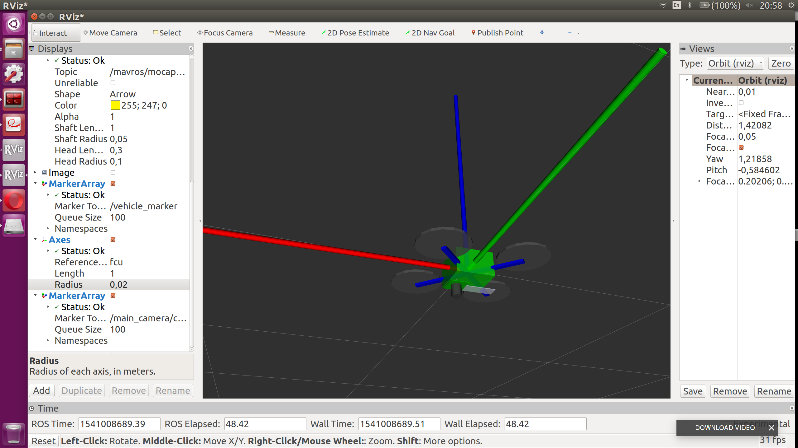

Using rviz and rqt
===


The [rviz] tool(http://wiki.ros.org/rviz) allows real-time visualization of all components of the robotic system —the system of coordinates, moving parts, sensors, camera images — on the 3D stage.

[rqt](http://wiki.ros.org/rqt) is a set of GUI for analyzing and controlling ROS systems. For example, `rqt_image_view` allows viewing topics with images, `rqt_multiplot` allows plot charts by the values in topics, etc.

To use rviz and rqt, a PC running Ubuntu Linux (or a virtual machine such as [Parallels Desktop Lite] (https://itunes.apple.com/ru/app/parallels-desktop-lite/id1085114709?mt=12) or [VirtualBox] (https://www.virtualbox.org)) is required.

Install package `ros-kinetic-desktop-full` or `ros-kinetic-desktop` using the [installation documentation](http://wiki.ros.org/kinetic/Installation/Ubuntu).

Start rviz
---

To start еру visualization of the state of Clever in real time, connect to it via Wi-Fi (`CLEVER-xxx`) and run rviz, specifying an appropriate ROS_MASTER_URI:

```(bash)
ROS_MASTER_URI=http://192.168.11.1:11311 rviz
```

If connection is not established, make sure the `.bashrc` of Clever contains line:

```(bash)
export ROS_HOSTNAME=`hostname`.local
```

Using rviz
---

### Visualization of the copter position

It is recommended to set the `map` frame as a reference frame. To visualize the copter, add visualization markers from topic `/vehicle_markers`. To visualize the camera of the copter, add visualization markers from topic `/main_camera/camera_markers`.

The result of copter and camera visualization is shown below:



### Visualization of the environment

You can view a picture with augmented reality from the topic of the main camera `/main_camera/image_raw`.

Axis or Grid configured to frame `aruco_map` will visualize the location [on the map of ArUco marks](aruco.md).

### jsk_rviz_plugins

It is also recommended to install additional useful plugins for rviz [jsk_rviz_plugins](https://jsk-docs.readthedocs.io/en/latest/jsk_visualization/doc/jsk_rviz_plugins/index.html). This kit allows visualizing topics like `TwistStamped` (velocity) `CameraInfo`, `PolygonArray`, and many more. To install, use command:

```(bash)
sudo apt-get install ros-kinetic-jsk-visualization
```

Starting the rqt toolkit
---


To start rqt for monitoring Clever status, use command:

```(bash)
ROS_MASTER_URI=http://192.168.11.1:11311 rqt
```

An example of starting a specific plugin (`rqt_image_view`):

```(bash)
ROS_MASTER_URI=http://192.168.11.1:11311 rqt_image_view
```

Brief description of useful rqt plugins:

* `rqt_image_view` – viewing images from topics like `sensor_msgs/Image`;
* `rqt_multiplot` – Building charts from the data from of arbitrary topics (installation: `sudo apt-get install ros-kinetic-rqt-multiplot`);
* Bag – working with [Bag-files](http://wiki.ros.org/rosbag).
